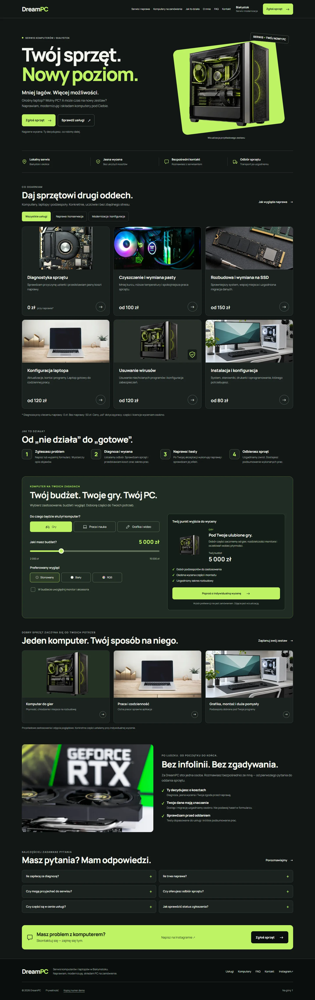
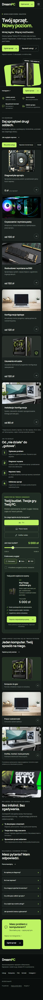

# DreamPC Service

Responsywna strona serwisu komputerowego z ofertą usług, konfiguratorem preferencji PC i trzyetapowym formularzem demonstracyjnym. Napisana w HTML, SCSS i Vanilla JavaScript.

**[Otwórz demo](https://beerck7.github.io/dreampc-service/)**



## Funkcje

- Filtrowanie usług: naprawa, konserwacja, modernizacja i konfiguracja.
- Wybór zastosowania komputera, budżetu, wyglądu oraz akcesoriów.
- Przeniesienie preferencji zestawu do formularza.
- Walidacja pól, błędy po polsku i podsumowanie przed zatwierdzeniem.
- Lokalny numer demo i pobieranie podsumowania jako pliku TXT.
- Menu mobilne, rozwijane FAQ i obsługa klawiaturą.
- Dodatkowe szablony grafik z eksportem PNG i PDF.

Oferta i obrazy mają charakter poglądowy. Konfigurator zbiera preferencje; nie dobiera automatycznie części i nie składa zamówienia. Fotografie nie przedstawiają napraw wykonanych dla klientów.

## Formularz demonstracyjny

Formularz **nie wysyła danych**. Całość działa w przeglądarce, bez backendu i zewnętrznej usługi formularzy. Użyj przykładowego imienia, telefonu i adresu e-mail.

Po walidacji przygotowywane jest lokalne podsumowanie. Krótki stan przetwarzania jest symulowany, a przyciski pozostają w tym czasie zablokowane. Plik TXT powstaje przez `Blob` i `URL.createObjectURL`. Dane nie są zapisywane w cookies ani localStorage; znikają po zamknięciu lub odświeżeniu karty. Pobrany plik pozostaje na urządzeniu użytkownika.

## Uruchomienie

Wymagany Node.js 22 lub nowszy.

```bash
git clone https://github.com/beerck7/dreampc-service.git
cd dreampc-service
npm ci
npm run dev
```

Adres lokalny: `http://127.0.0.1:4175`. Przy zajętym porcie można wskazać inny przez zmienną `PORT`.

Po zmianie SCSS uruchom `npm run styles`. Automatyczną kompilację można włączyć w drugim terminalu:

```bash
npm run styles:watch
```

## Organizacja kodu

```text
index.html          sekcje strony i formularze
privacy.html        opis działania formularza demo
styles/
  _base.scss        kolory, typografia i przyciski
  _layout.scss      sekcje oraz układ responsywny
  _forms.scss       formularz i listy wyboru
  main.scss         wejście kompilacji Sass
script.js           filtry, konfigurator, menu i formularz
form-controls.js    dostępne listy wyboru
assets/             obrazy WebP, znaki i lokalna czcionka
docs/               źródła grafik i zrzuty ekranu
scripts/            serwer lokalny, build, testy i eksport
dist/               wynik kompilacji, poza Gitem
```

Strona działa bez frameworka i bundlera. Sass kompiluje style do jednego pliku CSS. BEM porządkuje elementy sekcji, np. `service-card__photo` i `service-card--cleaning`. Logika pozostaje w dwóch małych skryptach; nie wymaga dodatkowego zarządzania stanem.

Natywne `dialog` obsługuje okna formularza, a `details` — FAQ. Dodatkowy widok list wyboru zachowuje wartości w elementach `select` i umożliwia obsługę klawiaturą.

## Responsywność i dostępność

Style bazowe dotyczą telefonów. Karty układają się w jedną kolumnę, a przy większej szerokości przechodzą w dwie lub trzy. Na telefonie dostępny jest stały pasek kontaktu; menu otwiera się przyciskiem i zamyka klawiszem Escape.

Strona ma semantyczne sekcje, link do pominięcia nawigacji, widoczny fokus oraz podpisane pola. Błędy są powiązane z polami przez `aria-describedby`, a komunikaty statusu używają `aria-live`. Preferencja `prefers-reduced-motion` wyłącza przejścia i płynne przewijanie. Bez JavaScript oferta i kontakt pozostają dostępne.



## Wydajność

Obrazy są zapisane lokalnie w WebP. Baner ma dwa rozmiary i wysoki priorytet ładowania; zdjęcia niżej ładują się na żądanie. Wymiary obrazów ograniczają przesunięcia układu. Czcionka Manrope jest dostarczana lokalnie. Strona nie pobiera bibliotek ani zdjęć z CDN.

## Sprawdzenie projektu

```bash
npm test
npm run build
```

Testy wymagają Google Chrome. Inny plik wykonywalny przeglądarki można wskazać zmienną `CHROME_PATH`.

Testy obejmują szerokości 320, 360, 390, 540, 768, 1024 i 1440 px, filtry usług, konfigurator, walidację, klawiaturę, pobieranie podsumowania oraz kontrolę dostępności axe-core według reguł WCAG AA. Sprawdzają też, że formularz nie wykonuje żądań POST, a wpisany tekst nie jest interpretowany jako HTML.

